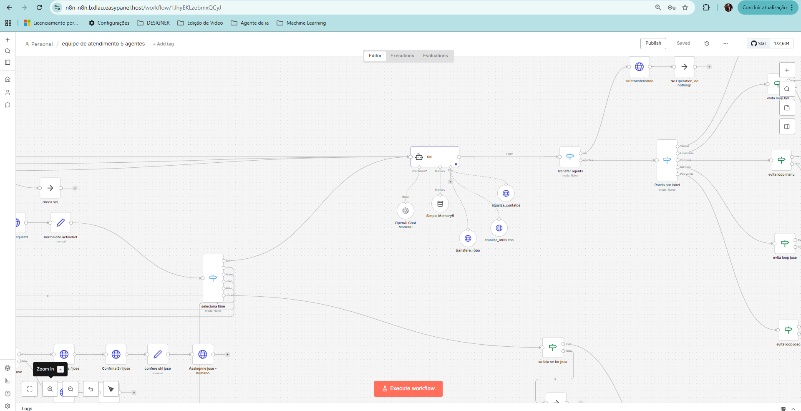
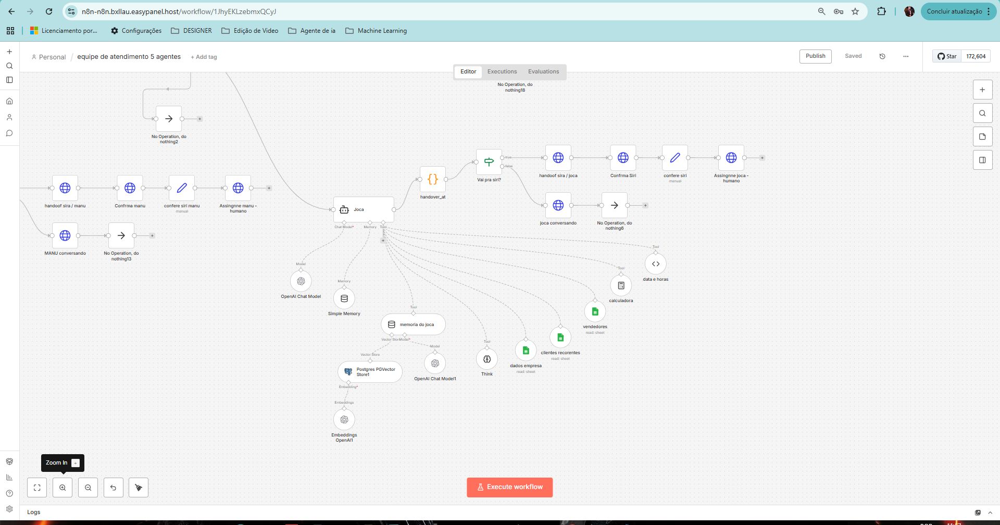
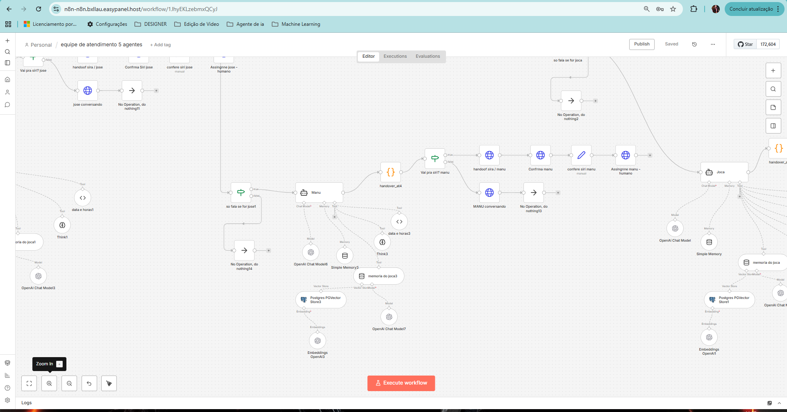
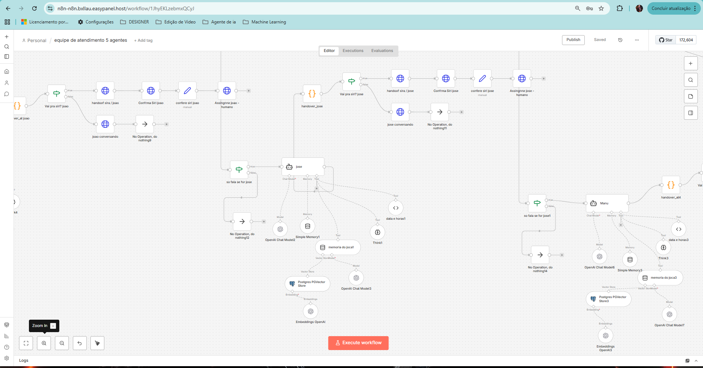
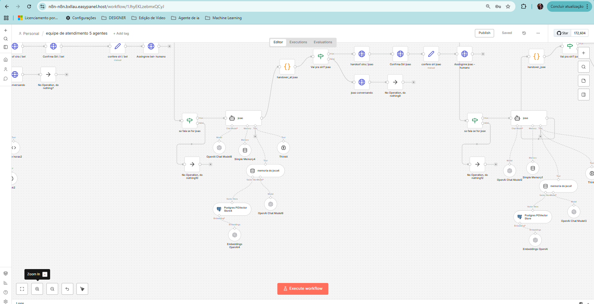
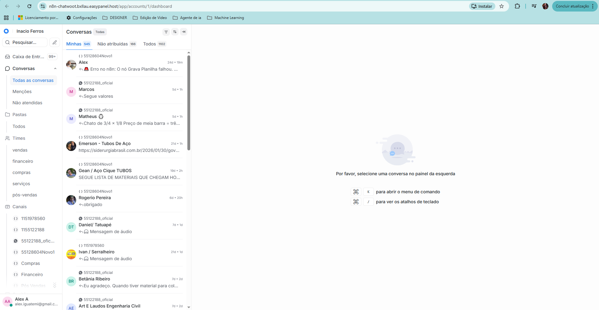

# 🤖 Equipe de Agentes de Atendimento com n8n + Chatwoot + WhatsApp

Projeto real de **arquitetura e implementação de uma equipe híbrida de agentes (IA + humanos)** para atendimento e pré-venda via WhatsApp, utilizando **n8n**, **Chatwoot** e **API de WhatsApp**, operando em ambiente de produção.

> 🔧 **Papel no projeto:** arquitetura da solução, integração entre sistemas, modelagem de fluxos, regras de negócio e operação em produção.

---

## 🧠 Problema Resolvido

Antes da solução, o cenário era:

- Atendimento manual e pouco escalável  
- Falta de roteamento inteligente entre agentes  
- Dificuldade de escalar equipe sem perder contexto  
- Dependência total de ação humana  
- Ausência de governança sobre quem atende o quê  

---

## ⚙️ Solução Implementada

Criação de uma **equipe de agentes coordenados**, onde IA e humanos trabalham juntos, com responsabilidades bem definidas.

### Componentes principais:

- **n8n** → Orquestração lógica dos agentes  
- **Chatwoot** → CRM, filas e atendimento humano  
- **WhatsApp API** → Canal oficial de comunicação  
- **OpenAI** → Agente conversacional  
- **PostgreSQL + Redis** → Estado, memória e controle  

📌 O diferencial não está nas ferramentas, mas **na forma como elas foram integradas para operar como um único sistema**.

---

## 🧱 Arquitetura Técnica

- VPS Ubuntu 24.04  
- Docker (infra isolada)  
- n8n (regras, fluxos e agentes)  
- Chatwoot (gestão de atendimento humano)  
- WhatsApp API (canal oficial)  
- PostgreSQL (dados e histórico)  
- Redis (estado de conversa e controle)

---

## 🧑‍🤝‍🧑 Equipe de Agentes (Visão Geral)

A operação é baseada em **múltiplos agentes especializados**, com fallback e escalonamento automático.

---

## 🤖 Agentes Implementados

### 🧠 Agente IA (Siri)
- Primeiro contato com o cliente  
- Coleta de informações  
- Respostas contextuais  
- Decisão de handover para humano  

---

### 👤 Agentes Humanos

Cada agente possui **papel definido**, com roteamento automático feito pelo n8n.

| Agente | Função |
|------|------|
| Joca | Atendimento técnico |
| Manu | Pré-venda |
| José | Suporte |
| João | Comercial |
| Bel | Atendimento geral |

**Exemplos visuais:**

---

## 🔄 Fluxo de Atendimento (n8n)

Fluxo responsável por:

- Receber mensagens do WhatsApp  
- Direcionar para IA ou humano  
- Manter contexto da conversa  
- Executar handover automático  
- Garantir que apenas um agente atenda por vez  

---

## 📊 Gestão no Chatwoot

O Chatwoot atua como **central de controle humano**, permitindo:

- Visualização das conversas  
- Assunção manual quando necessário  
- Histórico completo do atendimento  
- Trabalho em equipe  

---

## 📌 Regras de Negócio

- IA atende primeiro sempre que possível  
- Humano assume apenas quando necessário  
- Estado da conversa preservado  
- Nenhum cliente fica sem responsável  
- Um agente por conversa (anti-conflito)  

📁 Documentação detalhada:  
➡️ `docs/regras_de_negocio.md`

---

## 🧠 O Que Esse Projeto Demonstra

✔️ Capacidade de **arquitetar sistemas reais**  
✔️ Integração de múltiplas plataformas  
✔️ Modelagem de fluxos complexos  
✔️ Operação em produção  
✔️ Pensamento de engenheiro de automação  

---

## 💬 Frase Final (Portfólio / Recrutador)

> **“Não criei agentes. Criei uma equipe de atendimento funcionando em produção.”**

---

## 📌 Observação Importante

Este repositório é **exclusivamente sobre a equipe de agentes de atendimento**.  
Outras automações (follow-up, campanhas, etc.) estão documentadas em projetos separados.

---

⭐ Se esse projeto te ajudou ou te inspirou, considere deixar uma estrela.
